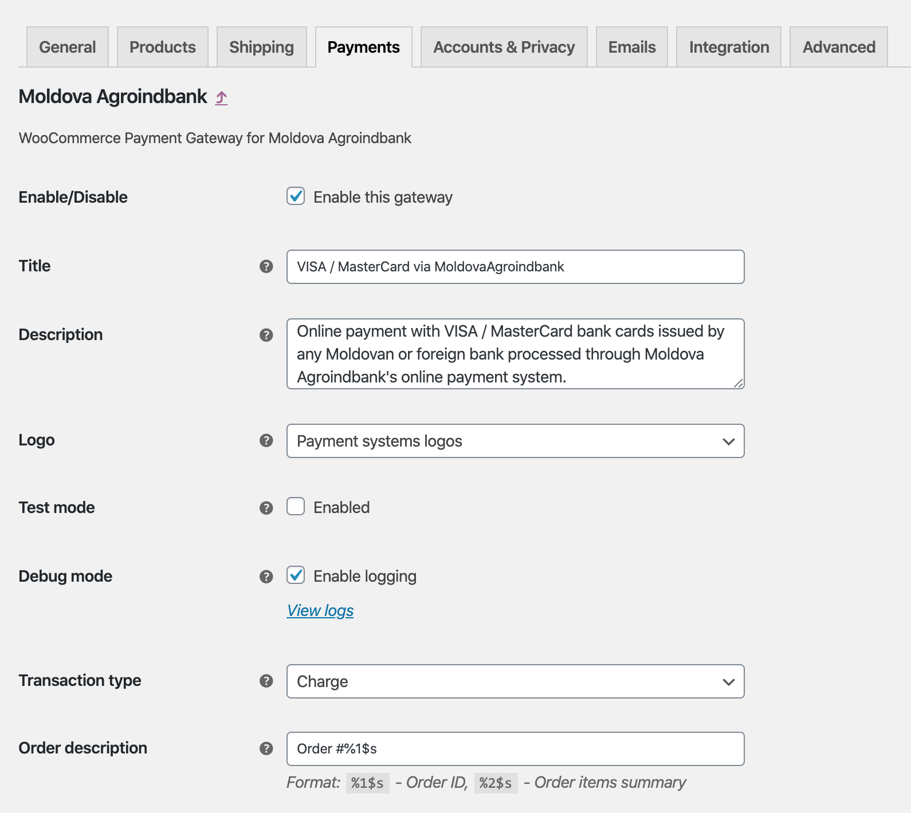
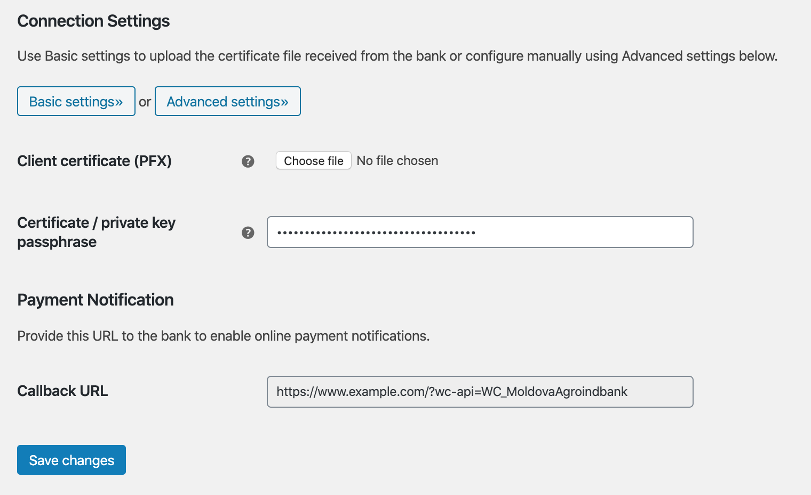
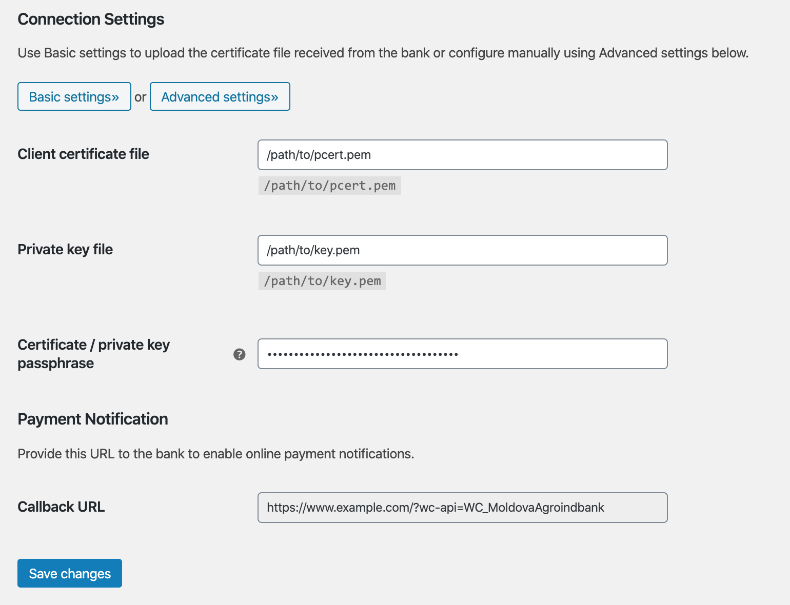
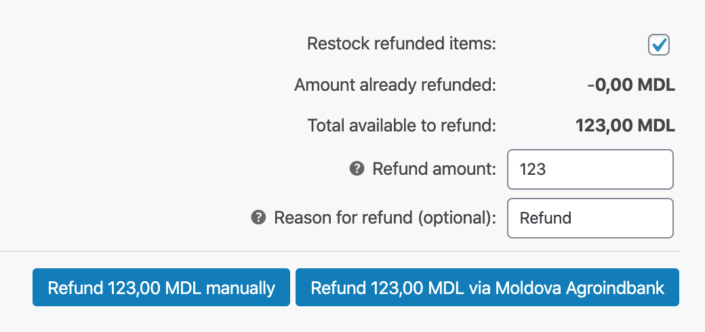
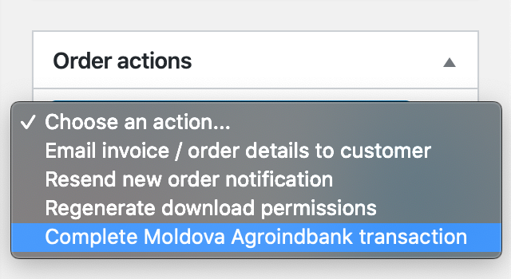

# Pasarela de Pagos para maib para WooCommerce

_Acepta pagos con Visa y Mastercard directamente en tu tienda con la Pasarela de Pagos para maib para WooCommerce._

Plugin de WordPress: https://wordpress.org/plugins/wc-moldovaagroindbank/

## Características

* Tipos de transacción con tarjeta: Cobro y Autorización
* Transacciones reversas – reembolsos parciales o totales
* Acciones administrativas de pedido – completar transacción autorizada
* Acción programada para cierre de día comercial
* Compatible con la [experiencia de pago basada en bloques de WooCommerce](https://woocommerce.com/checkout-blocks/)
* Gratuito para usar – [Licencia GPL-3.0 de código abierto en GitHub](https://github.com/alexminza/wc-moldovaagroindbank)

## Primeros Pasos

* [maib e-commerce](https://www.maib.md/en/persoane-juridice/e-commerce)
* [Instrucciones de instalación](https://wordpress.org/plugins/wc-moldovaagroindbank/installation/)
* [Preguntas frecuentes](https://wordpress.org/plugins/wc-moldovaagroindbank/faq/)

## Capturas de pantalla

1\. Configuración del plugin

2\. Configuración de conexión

3\. Configuración de conexión avanzada

4\. Reembolsos

5\. Acciones del pedido

