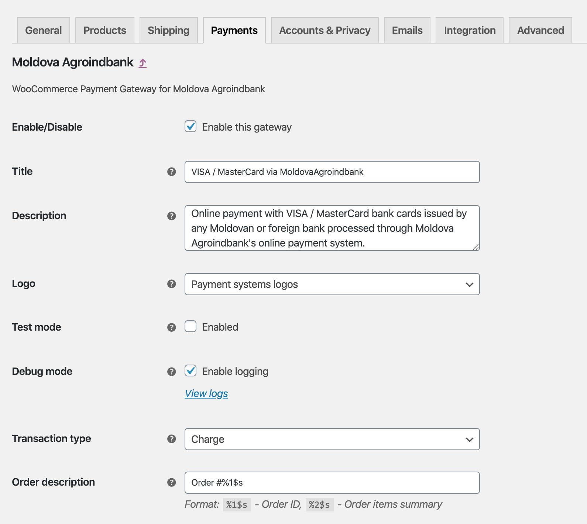
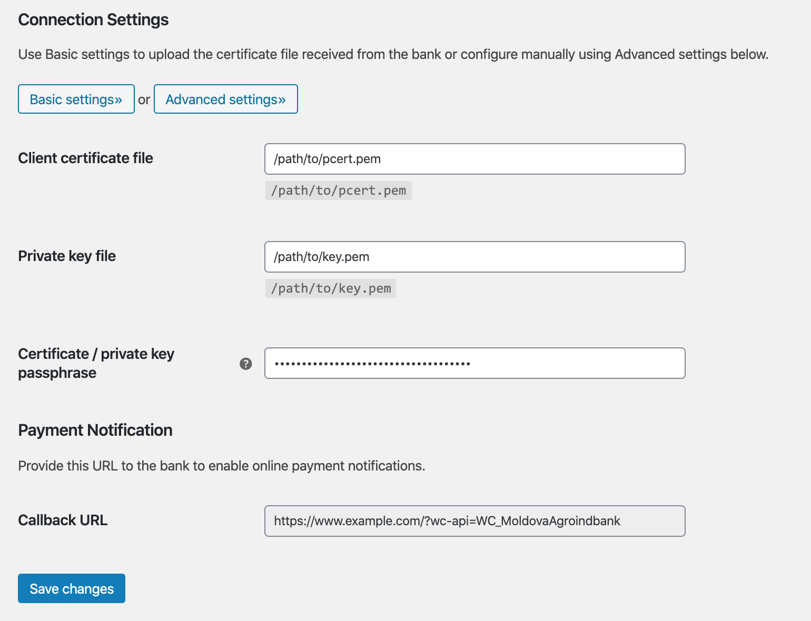
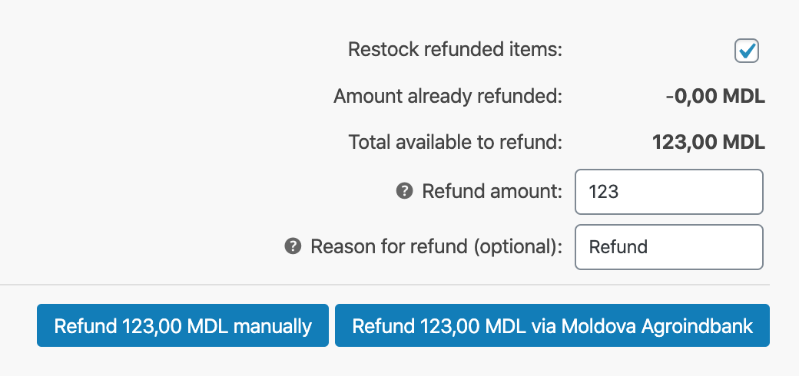
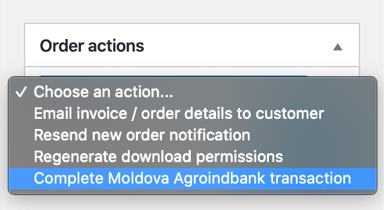

# Payment Gateway for maib for WooCommerce

_Accept Visa and Mastercard directly on your store with the Payment Gateway for maib for WooCommerce._

WordPress plugin: https://wordpress.org/plugins/wc-moldovaagroindbank/

## Features

* Charge and Authorization card transaction types
* Reverse transactions – partial or complete refunds
* Admin order actions – complete authorized transaction
* Close business day scheduled action
* Supports WooCommerce [block-based checkout experience](https://woo.com/checkout-blocks/)
* Free to use – [Open-source GPL-3.0 license on GitHub](https://github.com/alexminza/wc-moldovaagroindbank)

## Getting Started

* [Installation Instructions](https://wordpress.org/plugins/wc-moldovaagroindbank/installation/)
* [Frequently Asked Questions](https://wordpress.org/plugins/wc-moldovaagroindbank/faq/)

## Screenshots

1\. Plugin settings

2\. Connection settings

3\. Advanced connection settings

4\. Refunds

5\. Order actions

